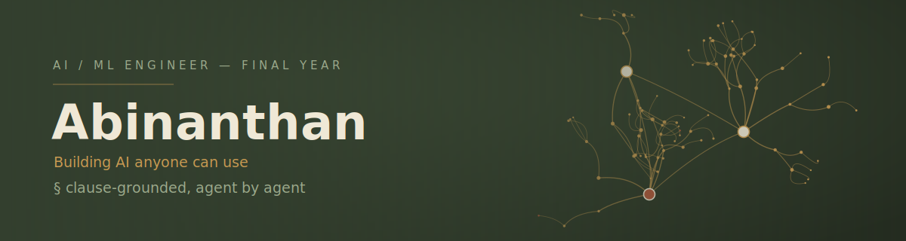

I care about how an AI system reasons, not just what it outputs. Most of what I build lives in **multi-agent RAG** — splitting a single model's guesswork into specialist agents that retrieve, argue, and settle disputes before committing to an answer.

Right now that means a clause-grounded contract review framework: three LangGraph agents — **Drafting**, **Adversarial Counsel**, and a **Mediator** — debate over clause-level retrieval instead of one model skimming a document and hoping for the best. Evaluated against CUAD. Still local, not pushed yet — the graph in the banner above is a small sketch of how they argue.

Outside coursework I fine-tune LLMs, prototype offline generative pipelines, and I'm slowly building **Refine** — a Notion-meets-Obsidian note app — for myself, whenever the agents let me take a break.

<strong>A few other things I've built</strong>

 

- **Loot & Till** — a farming-meets-heist browser game, self-contained in a single HTML file on Three.js. Farm defense, a stealth heist mode, AI rustlers, an upgrade loop.
- **Keor** — an offline prompt generator for ComfyUI/Krea workflows, three versions deep, with conflict detection so you can't accidentally ask for neon-graffiti lighting in a candid-daylight scene.
- **Cyber Grid** — a six-round CTF platform built for an intercollege event: OSINT, steganography, metadata, ciphers, web recon, binary reversing — wrapped in a hacker-terminal front end.
- A **chess app** running a WASM engine, skinned entirely in medieval-tavern pixel art, because a chessboard didn't need to look like every other chessboard.

### Tech Stack

**AI / ML**

**Web & Backend**

**Tools & Infra**

### Activity

  

### Connect

